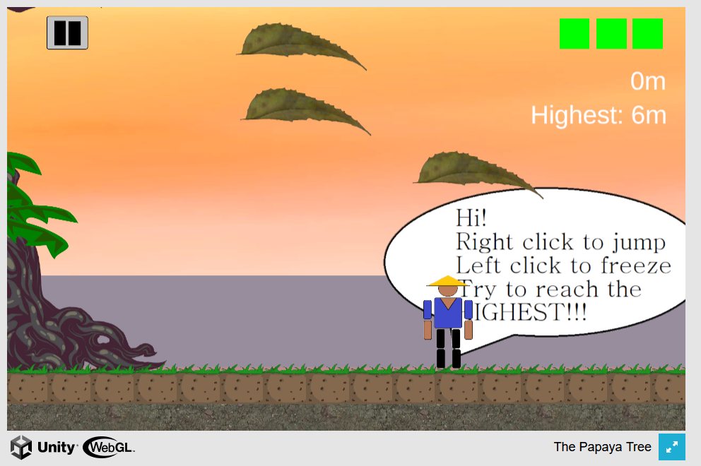

More Projects Below:

Papaya Tree, 2D Vertical Platformer Game Made with Unity and C# Independently 
[To Demo](https://papaya-tree.itch.io/the-papaya-tree?secret=o36sgrPmjy0y4Cgk09JzUSumR5U)
 

  
Flashflow, Study App Made With Electron and Javascriptt With a Team 
[To Repository](https://github.com/jasonkwan86/flashflow)
 

Note: I had more school and personal projects during my undergraduate studies, but I deleted that account
